# Design Document

## Instructions

## Brecghan's Training Matrix(BTM) Design

## 1. Problem Statement

Brecghan's Training Matrix is a comprehensive software solution designed to streamline and enhance the management of employee training within a company. This system provides an efficient and organized platform for tracking active employees, monitoring their training history, recording test results, and managing upcoming training expirations. This project aims to create a user-friendly, centralized tool to simplify the training process, improve compliance, and ensure that employees receive the necessary training to excel in their roles.

This design document describes the service that will provide the training matrix functionality to meet our customers' needs. It is designed to contain employees, trainings, and a testing tracker. It will be able to return current employees, trainings that have been conducted, and tests results from the different trainings.

## 2. Use Cases

U1. As a BTM customer, I want to create an employee

U2. As a BTM customer, I want to be able to create a training

U3. As a BTM customer, I want to be able to create a reoccurring training series

U4. As a BTM customer, I want to be able to create tests for trainings

U5. As a BTM customer, I want to be able to view all active trainings that are close to expiration

U6. As a BTM customer, I want to be able to update test results for retests

U7. As a BTM customer, I want to be able to view all trainings done within a series

U8. As a BTM customer, I want to be able to view specific trainings

U9. As a BTM customer, I want to be able to view all employees on a specific team

U10. As a BTM customer, I want to be able to view all tests taken by an employee

U11. As a BTM customer, I want to be able to deactivate employees that have left


Stretch goals

S1. As a BTM customer, I want to have my trainings auto-update their status based off of their date and months to expiration

S2. As a BTM customer, I want to be able to make the next training in a training series by copying the information from the most recent training


## 3. Project Scope

### 3.1. In Scope

* Creating, retrieving, and updating an employee
* Test list that can be searched by training or employee name
* Creating, retrieving, and updating a training
* Creating a reoccurring training series

### 3.2. Out of Scope

* Trainings auto-updating their status
* Training Series duplicator for next in series

# 4. Proposed Architecture Overview

This initial iteration will provide the minimum lovable product (MLP) including
creating, retrieving, and updating an employee, as well as retrieving a training and creating testing for it; and creating a Training Series.

We will use API Gateway and Lambda to create 15(20) endpoints (defined in section 6.2 "Endpoints")
that will handle the creation, update, and retrieval of Employees, Trainings, Tests and Training Series to satisfy our
requirements.

We will store employees, trainings, tests, and training series in their own tables in DynamoDB.

Brecghan's Training Matrix(BTM) will also provide a web interface for users to manage
the matrix. A main page providing connections to view trainings, employees, or test results. From those pages Users
will be able to create new items and link off to the other viewing pages.

# 5. API

## 6.1. Public Models

```
// EmployeeModel

String employeeId;
String employeeName;
Boolean isActive;
Enum team;
Date startDate;
Set<String> trainingsTaken;
Set<String> testsTaken;
Enum trainingStatus;
```

```
// TrainingModel

String trainingId;
String trainingName;
ZoneDateTime trainingDate;
Boolean isActive;
Integer monthsTilExpire;
Enum expirationStatus;
Set<String> testsForTraining;
Set<String> employeesTrained;
String trainingSeries;

```

```
// TestModel

String trainingId;
String employeeId;
Integer scoreToPass;
Integer latestScore;
Boolean hasPassed;
List<String> testAttempts;
```

```
// TrainingSeriesModel

String trainingSeriesName;
```

### 6.2. Get Employee Endpoint

* Accepts `GET` requests to `/employee/:employeeId`
* Accepts an employee ID and returns the corresponding EmployeeModel.
    * If the given employee ID is not found, will throw a
      `EmployeeNotFoundException`

### 6.3. Create Employee Endpoint

* Accepts `POST` requests to `/employee`
* Accepts data to create a new employee with a provided name, a given employee
  ID, a start Date, and a team. Returns the new employee.

### 6.4. Update Employee Endpoint

* Accepts `PUT` requests to `/employee/:employeeId`
* Accepts data to update an employee including updated employeeName, team, and isActive boolean. Returns the updated
  employee.
    * If the employee ID is not found, will throw a `EmployeeNotFoundException`

### 6.5. Get EmployeeList Endpoint

* Accepts `GET` requests to `/employee/`
* Returns a list of corresponding EmployeeModels.
* Accepts a parameter isActive that will return a list of active employees
* Accepts a parameter team that will return a list of employees from that team

### 6.6. Get Training Endpoint

* Accepts `GET` requests to `/training/:trainingId`
* Accepts a training ID and returns the corresponding TrainingModel.
    * If the given training ID is not found, will throw a
      `TrainingNotFoundException`

### 6.7. Create Training Endpoint

* Accepts `POST` requests to `/training`
* Accepts data to create a new training with a trainingName, trainingDate, trainingSeries(can be null), and monthsTilExpire and 
  returns the corresponding TrainingModel including a unique trainingId assigned by the Training Service. Returns the new training.

### 6.8. Update Training Endpoint

* Accepts `PUT` requests to `/training/:trainingId`
* Accepts data update a training: all instance variables other than name, date, trainingSeries, and ID can be updated.
    * If the training ID is not found, will throw a `TrainingNotFoundException`

### 6.9. Get TrainingList Endpoint

* Accepts `GET` requests to `/training/`
* Returns a list of corresponding TrainingModels.
* Accepts a parameter isActive that will return a list of active trainings
* Accepts a parameter expirationStatus that will return a list of trainings matching the provided status
* Accepts a parameter trainingSeries that will return a list of trainings matching the provided trainingSeries

### 6.10. Get Test Endpoint

* Accepts `GET` requests to `/test/:TestId`
* Accepts a Test ID and returns the corresponding TestModel.
    * If the given test ID is not found, will throw a
      `TestNotFoundException`

### 6.11. Create Test Endpoint

* Accepts `POST` requests to `/test/`
* Accepts data to create a new Test: a trainingId, a list of employeeIDs and an integer scoreToPass, 
  it then creates a test for this training for each employee on the list.

### 6.12. Update Test Endpoint

* Accepts `PUT` requests to `/test/:TestId`
* Accepts a trainingId, an employeeId, and a score update and returns the corresponding TestModel.
    * If the test ID is not found, will throw a `TestNotFoundException`

### 6.13. Get TestList Endpoint

* Accepts `GET` requests to `/test/`
* Returns a list of corresponding TestModels.
* Accepts a parameter trainingId that will return a list of tests for that training
* Accepts a parameter employeeId that will return a list of tests for that employee
* Accepts a parameter hasPassed that will return a list of tests for that training that match the provided status

### 6.14. Create TrainingSeries Endpoint

* Accepts `POST` requests to `trainingSeries`
* Accepts data to create a new reoccurring TrainingSeries: a trainingSeriesName and returns a list of Training Series,
  containing the newly added Series.

### 6.15. Get TrainingSeries Endpoint

* Accepts `GET` requests to `/trainingSeries/`
* Returns a list of corresponding TrainingSeries.

### 6.16. Get TrainingSeries Endpoint

* Accepts `GET` requests to `/trainingSeries/`
* Returns a list of corresponding TrainingSeries.

# 7. Tables

### 7.1. `employees`

```
employeeId // partition key, string
employeeName // string
isActive // boolean
team // string employees-by-team-index partition key
startDate // string
trainingsTaken // string set 
testsTaken // string set
trainingStatus // string
```

### 7.2. `trainings`

```
trainingId // partition key, string
trainingName // string
trainingDate // string
isActive // boolean
monthsTilExpire // number
expirationStatus // string
testsForTraining // string set
employeesTrained // string set
trainingSeries // string trainings-by-series-index partition key
```
 
### 7.3. `tests`

```
trainingId // partition key, string
employeeId // sort key, string tests-by-employee-index partition key
scoreToPass // number
latestScore // number
hasPassed // boolean
testAttempts // string set
```

### 7.4. `trainingSeries`

```
trainingSeriesName // partition key, string
```

- `tests-by-employee-index` includes ALL attributes
- `trainings-by-series-index` includes ALL attributes
- `employees-by-team-index` includes ALL attributes


# 8. Pages

### Welcome/Login Screen
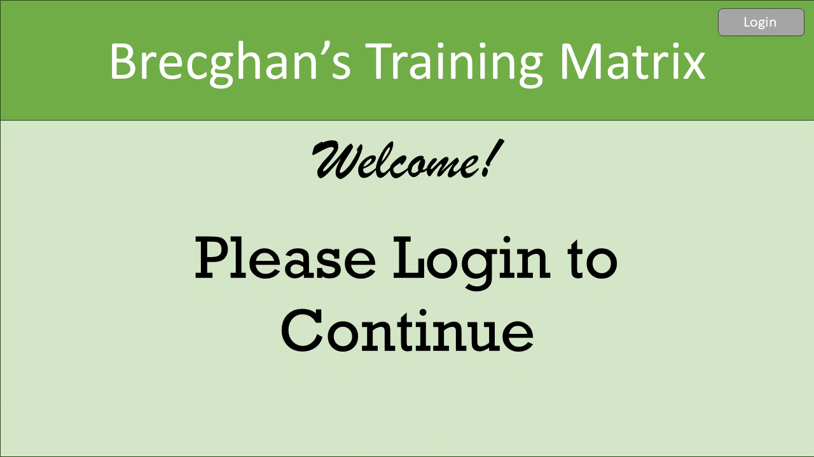
### Welcome Screen Post Login
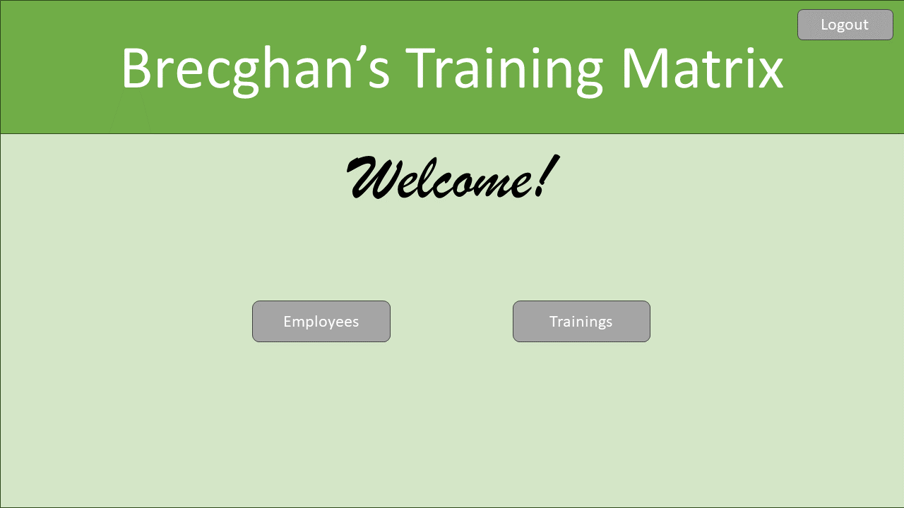
### Employee Base Page
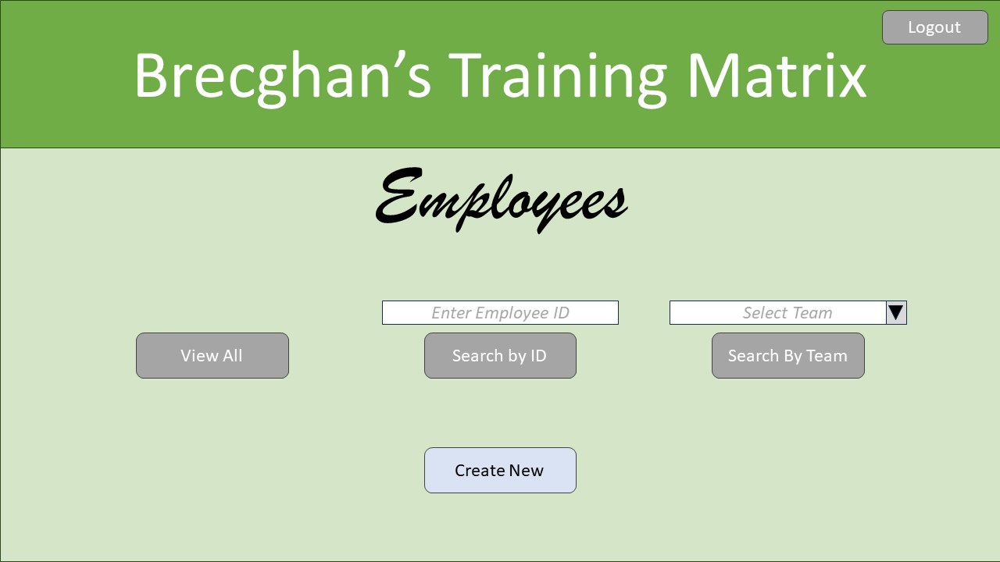
### Create Employee Page
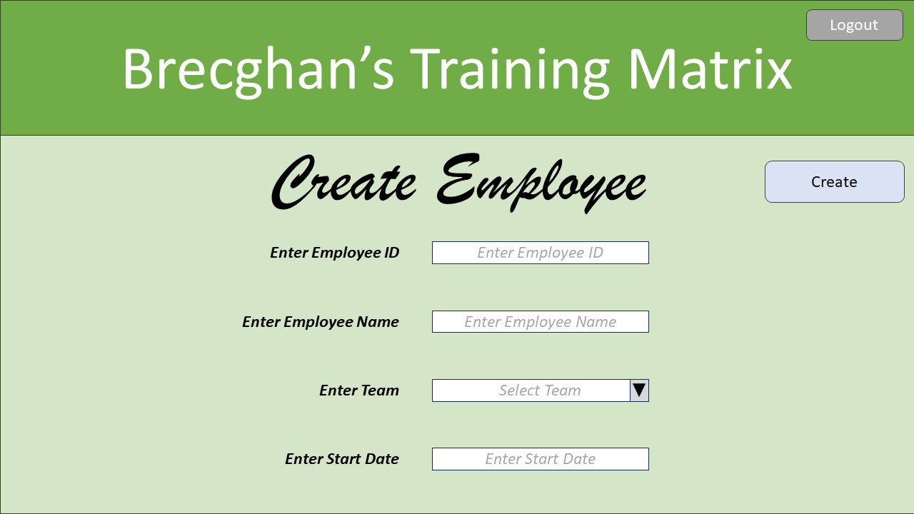
### Update Employee Page
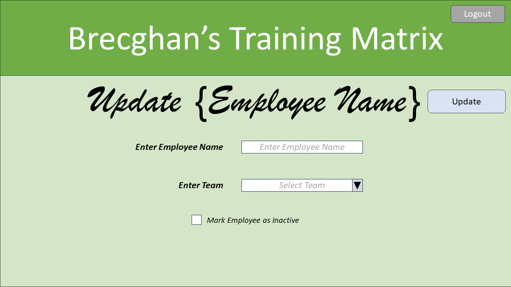
### Employee List Page
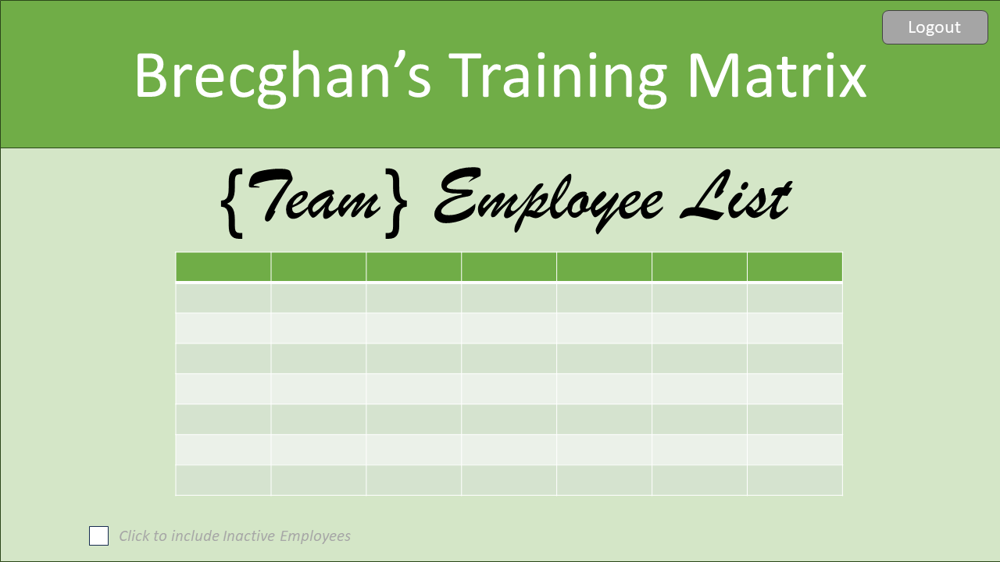
### View Employee Page
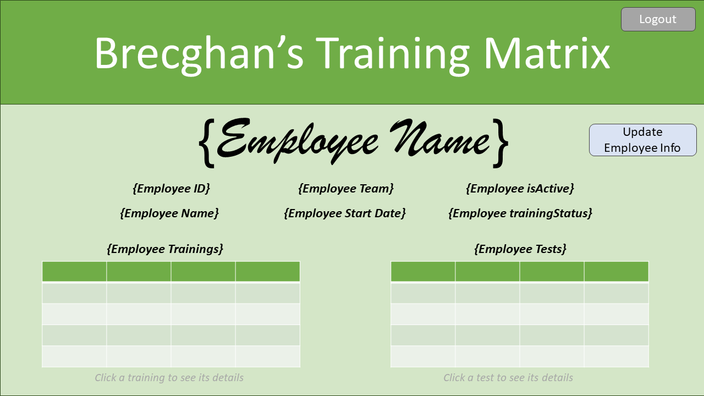
### Training Base Page
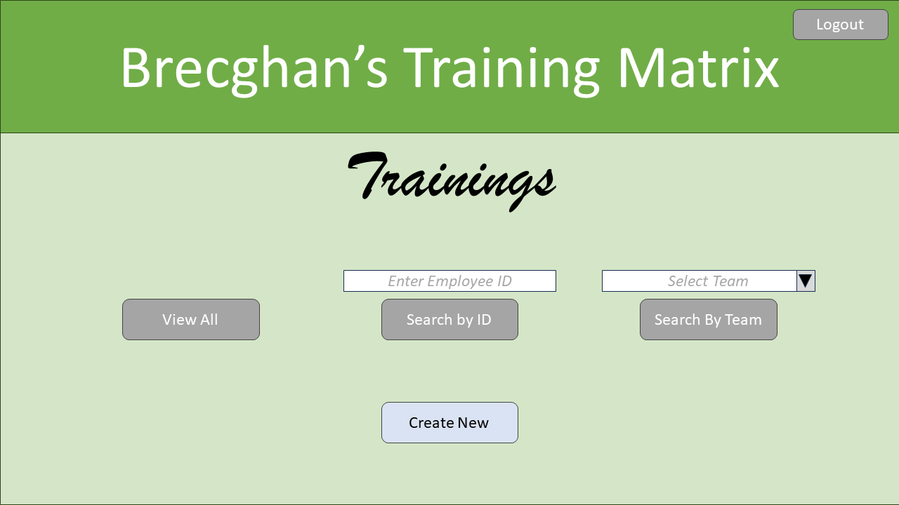
### Training List Page
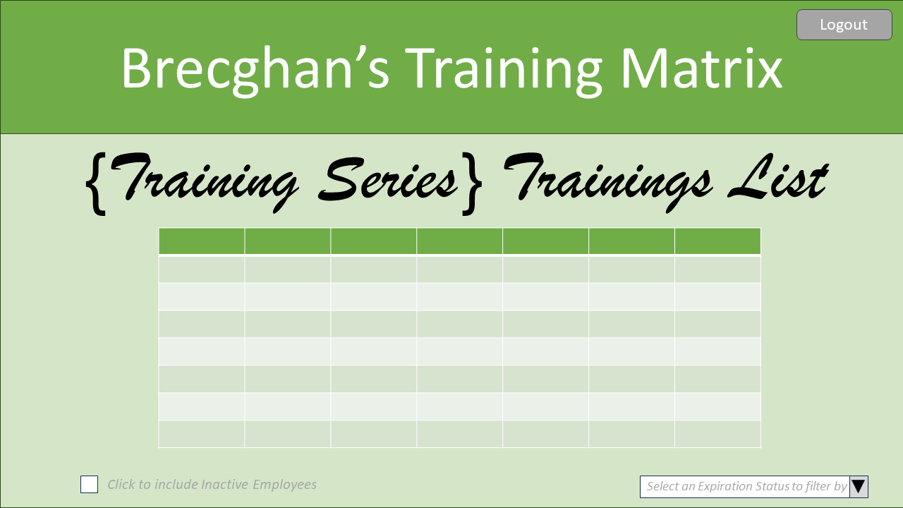
### Create Training Page
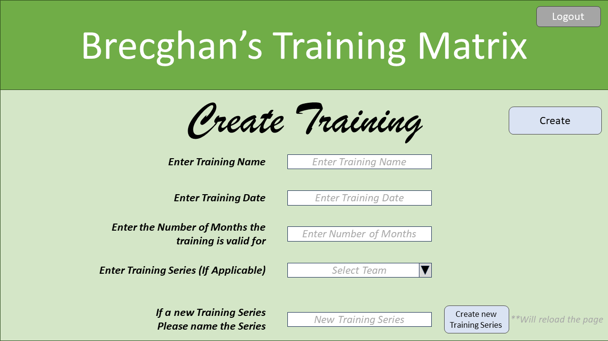
### View Training Page
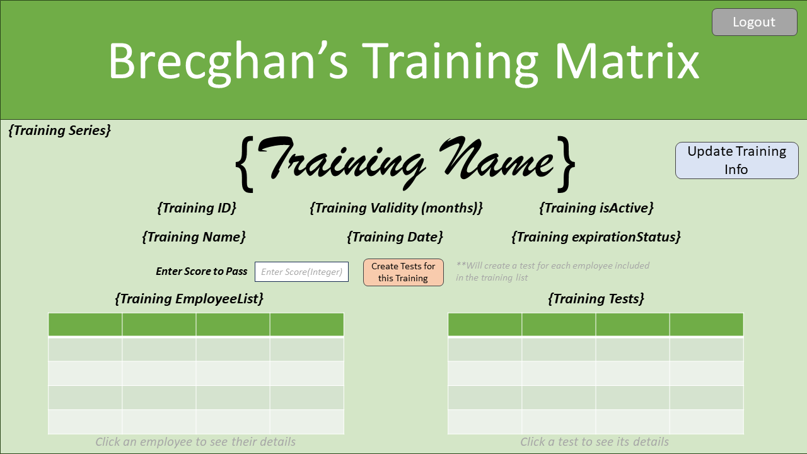
### Update Training Page
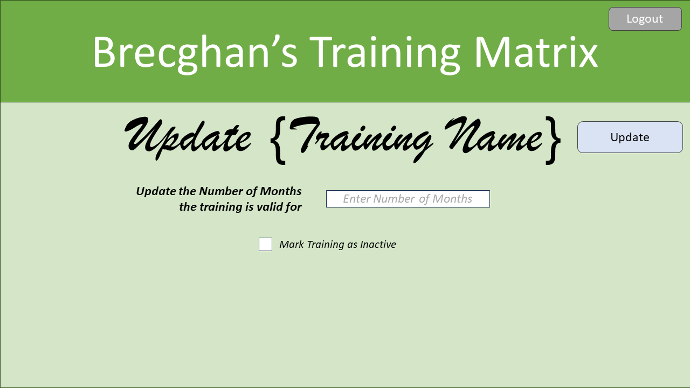
### View Test Page
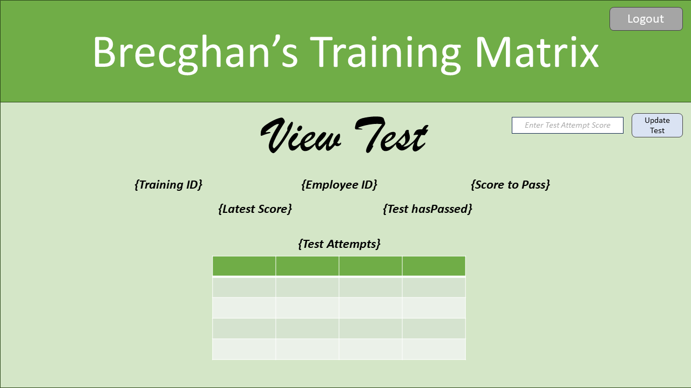
